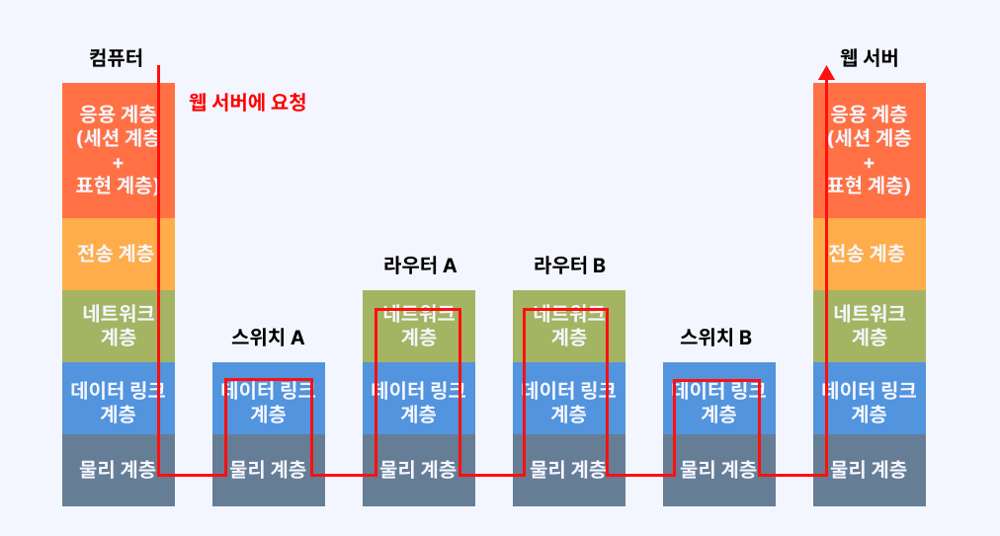
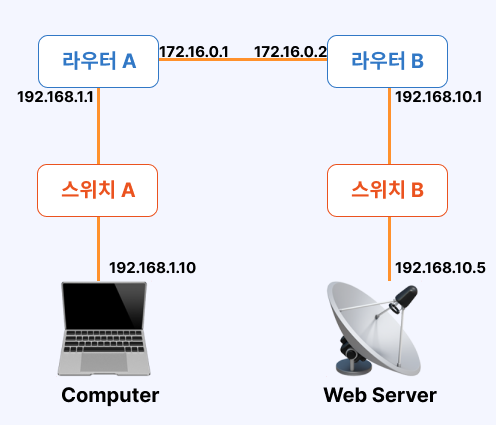

# 7장 응용 계층

## LESSON 28 응용계층의 역할

* 클라이언트 : 서버

* 클라이언트 - 서버 서버 프로그램간 통신 : 응용 계층의 프로토콜을 사용

* 주요 프로토콜 : HTTP, FTP, DNS, SMTP, POP3 등

## LESSON 29 웹 서버의 구조

* HTML : 하이퍼 텍스트 마크업 랭귀지, 태그를 사용해 문장 구조나 이미지 파일 표시

* 웹 브라우저는 웹 서버의 80번 포트를 통해 HTTP 통신을 함.

* HTTP 1.1 버전 : 데이터 교환시 연결 유지, 데이터 교환 끝나면 연결 단절 

* HTTP 2 버전 : 요청을 보낸 순서대로 응답을 보내지 않아도 된다.

## LESSON 30 DNS 서버의 구조

* DNS 서버는 도메인 이름을 IP 주소로 변환.

* URL : 호스트 이름 + 도메인 이름(호스트 : www, 도메인 : ssafy.com)

* 요청받은 DNS 서버가 해당 도메인 이름의 IP 주소를 모르는 경우 다른 DNS 서버에 질의

* DNS 서버는 전세계에 흩어져서 연계하며 작동

## LESSON 31 메일 서버의 구조 (SMTP, POP3)

* 메일 송신 : SMTP(프로토콜) 25번 포트 사용

* 메일 수신 : POP3(프로토콜) 110번 포트 사용

* 메일 서버간에도 SMTP를 사용하여 메일을 전송

 
 

# 8장 네트워크의 전체 흐름 살펴보기

## LESSON 32 랜 카드에서의 데이터 전달과 처리

### 컴퓨터의 데이터가 전기 신호로 변환되는 과정

* 웹 접속(URL 입력) -> OSI 상위 계층부터 캡슐화

* HTTP 프로토콜 사용 -> HTTP 메시지 전송

* **세그먼트** : 전송 계층에서 추가되는 TCP 헤더

* **패킷** : 네트워크 계층에서 추가되는 IP 헤더

* **이더넷 프레임** : 데이터 링크 계층에서 추가되는 이더넷 헤더와 트레일러

* 물리계층에서 데이터가 전기신호로 변환되어 전송

## LESSON 33 스위치와 라우터에서의 데이터 전달과 처리

### 스위치에서의 데이터 전달과 처리

* 스위치 A에 컴퓨터가 보낸 데이터가 전기 신호로 변환되어 전달 -> 스위치 A의 데이터 링크 계층에서 데이터를 전기 신호로 변환하여 라우터 A로 전송 

* 스위치 내에 대응되는 OSI 모델 계층 : 물리 계층, 데이터 링크 계층

### 라우터에서의 데이터 전달과 처리

* 라우터 내에 대응되는 OSI모델의 계층 : 물리 계층, 데이터 링크 계층, 네트워크 계층

## LESSON 34 웹 서버에서의 데이터 전달과 처리 

**데이터가 전기 신호로 웹 서버에 도착하면 웹 서버는 다음 흐름대로 역캡슐화**

1. 데이터 링크 계층에서 이더넷 프레임의 목적지 MAC과 자신의 MAC 비교

2. 일치하면 이더넷 헤더와 트레일러 분리 -> 네트워크 계층으로 전달

3. 목적지 IP 주소와 웹 서버의 IP주소 비교

4. 일치하면 IP 헤더 분리하고 전송계층으로 전달

5. 목적지 포트 번호를 확인하여 어떤 애플리케이션으로 전달해야하는지 판단, TCP 헤더를 분리해 응용 계층으로 전달

* 웹 서버 내에 해당하는 OSI 모델 계층은 물리 계층, 데이터 링크 계층, 네트워크 계층, 전송 계층, 응용 계층이다.
