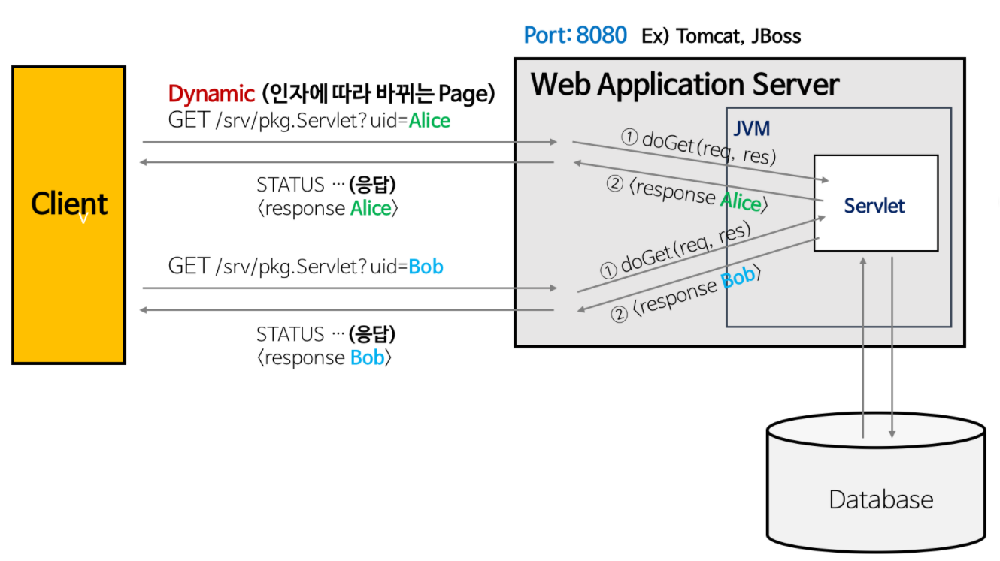

# 질문 1

<details><summary style="color:skyblue">서블릿이란 무엇인가요?</summary>
<p>



### 특징
* MVC 패턴에서 컨트롤러로 이용됨
* 클라이언트의 요청에 대해 동적으로 작동하는 웹 애플리케이션 컴포넌트
* 기존의 정적 웹 프로그램의 문제점을 보완하여 동적인 여러 기능을 제공
* JAVA의 스레드를 이용하여 동작
* 컨테이너에서 실행


```Java
/// 서블릿 형식
public class FirstServlet extends HttpServlet {
	@Override
    public void init() {
    ...
	}
    
    @Override
    public void doGet(HttpServletRequest req, HttpServletResponse resp) {
    ...
    }
    
    @Override
    public void destroy() {
    ...
    }
}
```

<details><summary style="color:skyblue"> 꼬리질문 1 - 서블릿의 생명주기는 어떻게 되나요? </summary>
<p>

1. 클라이언트의 요청이 들어오면 컨테이너는 해당 서블릿이 메모리에 있는지 확인하고, 없을 경우 init()메서드를 호출하여 메모리에 적재한다. init()은 처음 한번만 실행되기 때문에, 서블릿의 스레드에서 공통적으로 사용해야 하는 것이 있다면 오버라이딩 하여 구현하면 된다. 실행 중 서블릿이 변경될 경우, 기존 서블릿을 destroy()하고 init()을 통해 새로운 내용을 다시 메모리에 적재한다.

2. init()이 호출된 후 클라이언트의 요청에 따라서 service() 메소드를 통해 요청에 대한 응답이 doGet()과 doPost()로 분기된다. 이 때 서블릿 컨테이너가 클라이언트의 요청이 오면 가장 먼저 처리하는 과정으로 생성된 HttpServletRequest, HttpServleResponse에 의해 request와 response 객체가 제공된다.

3. 컨테이너가 서블릿에 종료 요청을 하면 destroy() 메소드가 호출되는데 마찬가지로 한번만 실행되며, 종료시에 처리해야 하는 작업들은 destroy() 메소드를 오버라이딩하여 구현하면 된다.

</p>
</details>

<details><summary style="color:skyblue">꼬리 질문 2 - 서블릿 컨테이너란 무엇인가요?</summary>
<p>

* 서블릿 컨테이너란, 구현되어 있는 servlet 클래스의 규칙에 맞게 서블릿을 담고 관리해주는 컨테이너다. 클라이언트에서 요청을 하면 컨테이너는 HttpServletRequest, HttpServletResponse 두 객체를 생성하여 post, get여부에 따라 동적인 페이지를 생성하여 응답을 보낸다.

</p>
</details>

</p>
</details>

# 질문 2

<details><summary style="color:skyblue">스프링에서 빈이란 무엇인가요?</summary>
<p>

* **스프링 IoC 컨테이너에서 관리하는 객체**
* 스프링의 ApplicationContext에서 빈의 라이프 사이클(초기화, 생성, 소멸)을 관리한다.
* `@Component`, `@Service`, `@Controller`, `@Repository` 등의 어노테이션을 활용해 빈 생성 가능

<details><summary style="color:skyblue">꼬리 질문 1 - 스프링의 IoC는 무엇인가요?</summary>
<p>

### IoC(제어의 역전)

> 프로그램의 제어 흐름을 개발자가 아닌 프레임워크나 컨테이너에게 위임하는 디자인 패턴

* 객체의 생명주기를 프레임워크에게 모두 맡기는 것(생성, 초기화, 소멸 등등) -> 개발자가 다른 부분에 신경을 쓸 수 있음

* 객체에 대한 제어권을 컨테이너에게 넘김으로써 컴포넌트 간 결합을 느슨하게 할 수 있다.

</p>
</details>

<details><summary style="color:skyblue">꼬리 질문 2 - 의존성 주입(DI)은 무엇인가요?</summary>
<p>

> IoC의 하위 개념, 외부에서 두 객체간의 관계를 결정해주는 디자인 패턴

* 스프링 컨테이너가 빈으로 객체를 관리하다가, 런타임 환경에서 관계를 동적으로 주입하게 되며, 유연성 확보 및 결합도를 낮출 수 있음.
* 한 객체가 다른 객체를 이용할때 의존성이 있다고 한다.


</details>


</p>
</details>


# 질문 3

<details><summary style="color:skyblue">컨텍스트 스위칭에 대해서 설명해보세요.</summary>
<p>

> 여러 개의 프로세스가 실행되고 있을 때 기존에 실행되던 프로세스를 중단하고 다른 프로세스를 실행하는 것.

* 어떤 하나의 프로세스를 실행하고 있는 상태에서 인터럽트 요청에 의해 다음 우선 순위의 프로세스가 실행되어야 할 때 기존의 프로세스의 상태 또는 레지스터 값(Context)을 저장하고 CPU가 다음 프로세스를 수행하도록 새로운 프로세스의 상태 또는 레지스터 값(Context)를 교체하는 작업

* Context는 PCB에 저장됨

* PCB의 저장 정보 : 프로세스 상태, 프로그램 카운터, 레지스터, 프로세스 번호 

<details><summary style="color:skyblue">꼬리 질문 1 - 컨텍스트 스위칭이 일어나는 상황</summary>
<p>

1. I/O 인터럽트
2. CPU 사용시간 만료
3. 자식 프로세스 FORK
4. 인터럽트 처리 대기

</p>
</details>

<details><summary style="color:skyblue">꼬리 질문 2 - 컨텍스트 스위칭의 오버헤드</summary>
<p>

* 컨텍스트 스위칭이 발생할 때는 CPU가 아무런 동작도 하지 못하기 때문에 오버헤드가 발생

</p>
</details>

</p>
</details>