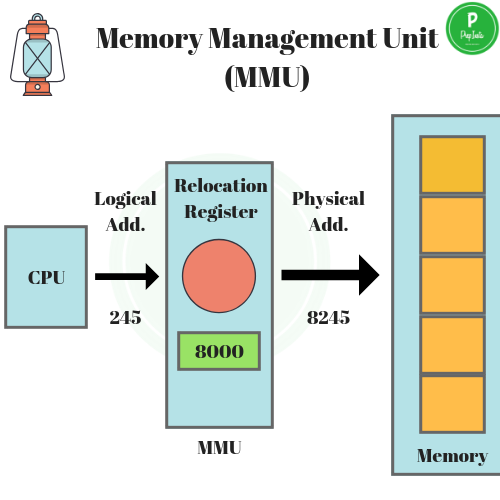

# 질문 1

메모리의 공간 구조에 대해서 설명해주세요.

1. 힙 영역 : 개발자가 할당/해제하는 메모리 공간, 이 공간에 메모리를 할당하는 것을 동적 할당(Dynamic Memory Allocation)이라고 한다. 런 타임시에 크기가 결정된다.
2. 스택 영역 : 프로그램이 자동으로 사용하는 임시 메모리 영역, 함수 호출 시 생성되는 지역 변수와 매개변수가 저장되는 영역. 함수 호출이 완료되면 사라지게 된다.
3. 코드 영역 : 소스코드가 저장되는 영역, 텍스트 영역이라고도 부른다.
4. 데이터 영역 : 전역변수 및 static 변수가 할당되는 영역, 프로그램의 시작과 동시에 할당되고 프로그램이 종료되면 메모리가 소멸됨

* 스택과 힙은 같은 공간을 공유한다. 스택이 힙의 공간을 침범할 경우에는 STACK OVERFLOW, 힙이 스택의 공간을 침범할 경우 HEAP OVERFLOW가 발생한다.
* 스택은 메모리 공간의 아래부터, 힙은 위에서부터 할당된다.

 꼬리 질문 1 - 스택 오버플로우와 힙 오버플로우는 왜 발생하며, 이를 방지하기 위한 방법은 무엇인가요?

스택 오버플로우 : 재귀 호출이 지나칠 경우, 혹은 지역 변수가 너무 많이 할당될 경우 발생 - 재귀 대신 반복문을 사용하거나 함수 호출을 최소화하과, 필요하지 않은 지역 변수의 사용을 자제하는 것으로 해결할 수 있다.
힙 오버플로우 : 동적으로 할당된 메모리가 너무 많아져서 사용가능한 힙 메모리를 모두 소진하였을 경우 발생 - 메모리 누수를 방지하고 필요하지 않은 객체는 생명주기를 적절히 관리하여 메모리 할당을 해제할 수 있도록 한다.   

꼬리 질문 2 - 주소 바인딩이 무엇인가요? 

> 프로그램이나 프로세스 내의 가상 주소를 실제 물리적 메모리 주소에 연결하는 과정 

* 프로그램을 실행할 때, 프로그램이 사용하는 변수나 명령어들의 주소를 실제 메모리의 주소로 변환해야하는데, 이러한 작업을 주소바인딩이라고 한다.

컴파일 시간 바인딩(Compile-time Binding):
프로그램이 컴파일될 때 변수나 함수의 주소가 결정. 이 경우, 프로그램은 항상 같은 물리적 메모리 주소에서 실행되어야 하며, 이를 '절대 코드(Absolute Code)'라고 함. 컴파일러는 실행 파일을 만들 때 모든 주소를 실제 메모리 주소로 변환.

로드 시간 바인딩(Load-time Binding):
프로그램이 메모리로 로드될 때 주소 바인딩이 수행됩니다. 컴파일러는 상대 주소를 생성하고, 실제 메모리 주소는 프로그램이 메모리에 로드될 때 할당됩니다. 만약 프로그램이 다른 메모리 위치로 이동되면, 바인딩은 다시 수행되어야 합니다.

실행 시간 바인딩(Execution-time Binding) 또는 런타임 바인딩(Runtime Binding):
프로그램이 실행되는 동안에 이루어지는 주소 바인딩. 현대 운영 체제에서는 주로 '가상 메모리(Virtual Memory)' 시스템을 사용하여 실행 시간에 주소를 바인딩합니다. 프로세스가 사용하는 가상 주소는 실제 메모리 주소로 변환되어야 하며, 이 변환은 하드웨어적으로 지원되는 '메모리 관리 유닛(Memory Management Unit, MMU)'에 의해 동적으로 수행됩니다.

꼬리 질문 3 - 가상 메모리란? 

가상 메모리(virtual memory) :  컴퓨터 시스템의 메모리 관리 기술 중 하나로, 사용 가능한 물리적 메모리(RAM)보다 더 큰 프로그램을 실행할 수 있도록 해준다. 

* 물리적 메모리와 보조 저장 장치(주로 하드 디스크나 SSD)의 공간을 효율적으로 사용하여, 프로그램이 실제 물리적 메모리의 한계를 넘어서더라도 실행될 수 있게 만들어줌

* 가상 메모리는 주소 공간을 '페이지(page)'라는 단위로 나누고, 이 페이지들을 필요에 따라 물리적 메모리와 보조 저장 장치 사이에서 교체(swap)한다. 프로그램은 실제 물리적 주소 대신에 '가상 주소(virtual address)'를 사용하여 메모리에 접근하며, 운영체제의 메모리 관리자가 이 가상 주소를 실제 물리적 주소로 변환(mapping)한다.

### 장점
큰 메모리 공간 제공: 프로그램은 물리적 메모리보다 훨씬 큰 주소 공간을 사용할 수 있습니다.
메모리 보호: 각 프로그램은 독립된 가상 주소 공간을 가지므로 다른 프로그램의 메모리 영역을 침범할 수 없습니다.
데이터 공유: 프로세스 간에 페이지를 공유함으로써 데이터를 효율적으로 공유할 수 있습니다.
메모리 할당의 유연성: 물리적 메모리의 연속적인 공간에 구애받지 않고 메모리를 할당할 수 있습니다.

