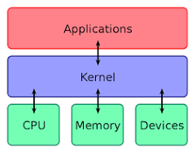

# 질문 1

<details><summary style="color:skyblue">커널에 대해서 설명해주세요.</summary>
<p>



### 커널?

사전적인 의미로 "알맹이, 핵심"이란 뜻을 가지고 있음.
커널은 **운영 체제의 핵심부로 컴퓨터 자원들을 관리하는 역할**을 수행한다.

컴퓨터 자원 : CPU, 메모리, 파일, 네트워크, I/O 장치

> 커널은 사용자가 물리적인 하드웨어에 접근하고 사용할 수 있도록 하기 위한 인터페이스를 제공한다.

### 커널의 추상화

커널은 컴퓨터의 물리적 자원과 추상화 자원을 관리한다.

#### 물리적 자원 이름 -> 추상화한 자원 용어

* CPU -> 태스크(Task)
* 메모리(memory) -> 페이지(page), 세그먼트(segment)
* 디스크(disk) -> 파일(file)
* 네트워크(network) -> 소켓(socket)

### 커널의 역할
커널의 5가지 관리자
* 태스크 관리자 : 물리적 자원인 CPU를 추상 자원인 태스크로 제공
* 메모리 관리자 : 물리적 자원인 메모리를 추상 자원인 페이지나 세그먼트로 제공
* 파일 시스템 관리자 : 물리적 자원인 디스크를 추상 자원인 파일로 제공
* 네트워크 관리자 : 물리적 자원인 네트워크 장치를 추상 자원인 소켓으로 제공
* 디바이스 드라이버 관리자 : 각종 외부 장치(프린터, GPU 등)에 대한 접근을 제공
<details><summary style="color:skyblue">꼬리 질문 1 - 커널 모드와 사용자 모드의 차이 </summary>
<p>

사용자 모드의 응용 프로그램은 직접적으로 운영체제의 물리적 자원에 접근할 수가 없음. 이 때 사용자 프로그램이 물리적 자원을 이용할 수 있도록 커널이 제공하는 인터페이스가 시스템 콜임. 파일을 읽거나 쓰고 싶은 응용 프로그램에게 open, read, write와 같은 시스템 콜을 제공하는 것. 프로그램이 시스템 콜을 호출하면 커널 모드로 전환해서 작업을 수행하고, 작업 결과물을 반환하고 다시 사용자 모드로 전환하게 됨. 이러한 방식을 통해 커널은 파일 시스템, 네트워크 인터페이스, I/O 디바이스 들을 보호하는 역할을 수행함.

</p>
</details>

</p>
</details>

<br>

# 질문 2

<details><summary style="color:skyblue">String과 StringBuilder, StringBuffer의 차이에 대해서 설명해주세요.</summary>
<p>

* String
    * 불변 자료형 : 한 번 생성된 객체의 값을 변경할 수 없음. 아래와 같이 value가 `final`로 선언됨.
    ``` java
    public final class String implements java.io.Serializable, Comparable {
	private final byte[] value;}
   ```
   * 코드 상으로는 기존 객체의 값을 변경한 것처럼 보이지만, 실제로는 새로운 인스턴스를 생성하게됨.
   * 변경을 가한 것처럼 보인 기존 객체는 더 이상 쓰이지 않게 되며, GC의 대상이 됨
   * `+`로 연산을 하기 때문에 가독성 측면에서는 장점이 있음.
* StringBuffer
    * 가변 자료형 : 한 번 생성된 `StringBuilder` 객체의 값은 변경이 가능함.
    ```java
    public final class StringBuffer implements java.io.Serializable {
	private byte[] value;}    
    ```
    * 스레드 안전성 : 여러 스레드가 동시에 동일한 `StringBuffer` 인스턴스에 접근해도 안전하게 작업을 수행할 수 있음.
    * 성능 : 스레드 안전성을 위한 `synchronized` 키워드를 사용하기 때문에 `StringBuilder`에 비해 성능이 낮을 수 있음
* StringBuilder
    * 가변 자료형 : `SpringBuffer`와 동일
    * 스레드 안전성 : `SpringBuffer`와 다르게 멀티 스레드 환경에서 안전하지 않음, 멀티 스레딩을 할 경우 외부 동기화 작업이 필요
    * 성능 : `StringBuffer`에 비해 더 빠른 성능 제공, 동기화 작업에 대한 오버헤드가 없기 때문에 더 빠른 조작이 가능

`StringBuilder`와 `StringBuffer`는 동일한 메서드를 사용한다. 또한 불필요한 인스턴스를 생성하지 않기 때문에 메모리 측면에서 유리해보이지만, 상황에 따라 `String`이 더 유리할 때도 있다. 멀티 스레딩 환경에서 안전하게 동작하며 `final`키워드를 사용하기 때문에 상황에 맞게 사용할 수 있음.
    </p>
</details>