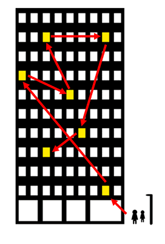

# 자료구조의 기본, 배열(Array) vs 연결 리스트(Linked List)

자료구조는 크게 메모리 공간 기반의 연속 방식과 포인터 기반의 연결 방식으로 나뉜다.

이 중에서 **배열(Array)**은 연속 방식의 기본이 되는 자료구조이고,
**연결 리스트(linked list)**는 포인터 방식의 기본이 되는 자료구조이다.

연속 방식의 자료구조 : 큐
포인터 방식의 자료구조 : 스택

## 배열

> 여러 개의 동일한 타입의 요소를 메모리 상에서 저장하는 구조로, 하나 이상의 인덱스 또는 키로 식별된다.

기본적인 형태는 크기를 지정하고 해당 크기만큼의 **연속된 메모리 공간**을 할당 받는다. 이 공간에서의 작업을 수행하는 자료형이 배열이다.

### 배열의 기본 연산

* **접근** : 인덱스를 아는 경우, 배열의 특정 인덱스에 접근하는 것은 O(1)의 시간 복잡도를 가진다.
  
* **삽입** : 배열의 특정 위치에 요소를 삽입하는 경우 최악의 경우에 O(n)의 시간 복잡도를 가진다.
  
* **삭제** : 배열에서 특정 요소를 삭제할 경우 최악의 경우 O(n)의 시간 복잡도를 가진다.
  
  * 배열은 모든 원소가 연속된 메모리 공간에 저장되어야 하기 때문에 최악의 경우 모든 요소를 한칸씩 밀어야 할수도 있다.

* **검색** : 특정 값(value)를 찾는 연산은 O(n), 이진 탐색의 경우 O(logn)

### 동적 배열

동적 배열은 배열의 크기를 동적으로 할당할 수 있도록 확장한 자료구조이다. 기존 배열의 경우에는 배열 내 자료를 복사해서 새로운 크기의 메모리를 할당받고 그 공간에 새로 저장해야 하지만 동적 배열은 필요에 따라 자동으로 크기를 확장하거나 축소할 수 있다. 

## 연결 리스트

위 그림처럼 흩어져 있는 자료를 포인터를 통해 연결해놓은 것이 연결 리스트라고 할 수 있다.

배열과는 다르게 연속적인 메모리 공간이 필요하지 않기 때문에 메모리를 효율적으로 사용할 수 있다.

### 용어

노드 : 데이터 요소
헤드 : 연결 리스트의 시작점

### 노드

* 노드는 두가지 정보가 필요하다

    1. 노드의 값
    2. 다음 노드의 위치(포인터)

이 두가지 데이터가 위의 그림에서 보이는 Data field와 Link field에 각각 저장된다.

### 헤드

> 가장 앞에 저장된 노드

앞에 연결된 노드가 없기 때문에 가장 앞에 저장된 노드의 정보는 따로 저장할 필요가 있다. 헤드의 경우 위 건물 사진에서 봤을 때 출입구가 되는 셈이다.

### 연결 리스트의 기본 연산

* **접근** : 시간 복잡도 O(n)
  * 배열과의 차이점 : 인덱스 개념이 없기 때문에 n번째 요소에 접근하려고 할 경우 처음부터 n번째까지 순회해야한다.
* **삽입** : 리스트의 시작 위치에 삽입할 경우 : O(1)
  * 리스트의 중간 또는 끝에 삽입 : O(n)
* **삭제** : 리스트의 시작 위치에서 삭제할 경우 : O(1)
  * 리스트의 중간 또는 끝에서 삭제 : O(n)
* **검색** : O(n)의 시간 복잡도, 특정 값(Date field에 저장된 값)을 가진 노드를 찾기 위해서 최악의 경우 모든 리스트를 순회해야한다.

### 배열과의 차이점

* 중간 삽입 및 삭제 : 배열의 경우 연속된 메모리 공간에 할당되어있기 때문에 끝에 삽입하거나 삭제할 경우에는 효율적이지만 중간 삽입, 삭제는 효율적이지 못하다(새로운 요소를 넣어서 한칸씩 뒤로 밀거나, 요소가 삭제된 빈 공간을 채우기 위해 앞으로 요소들을 끌어와야함). 반면에 연결 리스트의 경우에는 **중간에 있는 노드를 삽입하거나 삭제할 경우** 특정 노드의 포인터를 수정하면 되기 때문에 배열에 비해 빠른 시간 내에 연산이 가능하다.

* 메모리 할당 : 연결 리스트의 경우 연속된 공간을 할당받을 필요가 없기 때문에 더 유연하게 메모리 관리가 가능하다.

### 종류

* 단일 연결 리스트 : 각 노드가 데이터와 다음 노드를 가리키는 포인터로 구성되어있음.
* 이중 연결 리스트 : 각 노드가 데이터와 다음 노드를 가리키는 포인터, 이전 노드를 가리키는 포인터로 구성되어있음.
* 환형 연결 리스트 : 마지막 노드가 첫번째 노드를 가리키는 포인터를 가지고 있음.