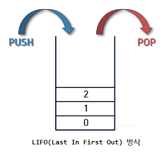
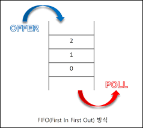

# 스택

후입 선출(Last In First Out), 쌓아 올린다는 개념

### **top**
가장 최근에 들어온 자료를 가리키는 값

### push & pop

**push** : top 위에 자료를 삽입, top +1
**pop** : top에 있는 자료를 삭제, top -1

 

# 큐

선입 선출(First In First Out), 줄을 서서 기다리는 것. 맨 앞 사람은 자기 차례가 오면 삭제되고, 마지막으로 온 사람은 줄의 맨 뒤에 가서 기다린다.

### front & rear

**front** : 삭제연산만 수행되는 곳, 첫 원소

**rear** : 삽입연산만 이루어지는 곳, 가장 끝 원소

### inqueue & dequeue

* inqueue : 삽입 연산

* dequeue : 삭제 연산