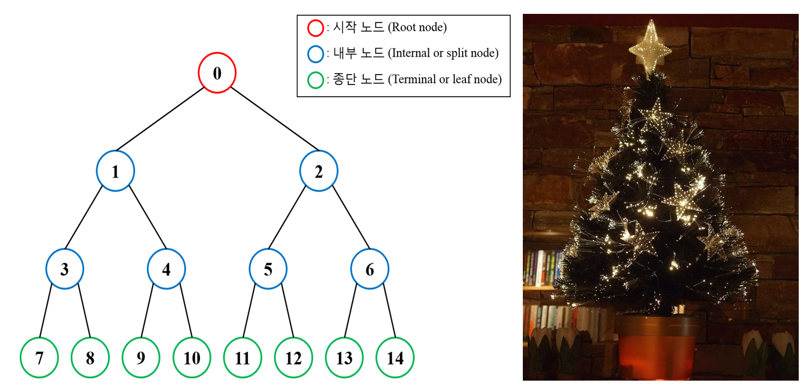
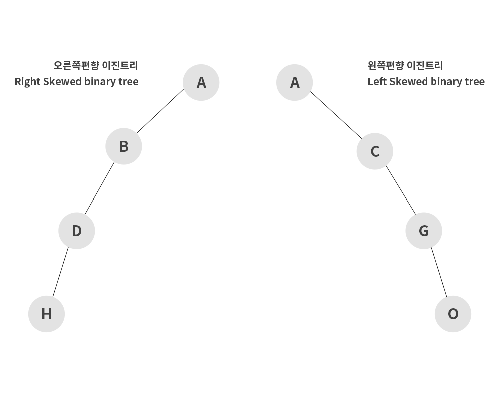
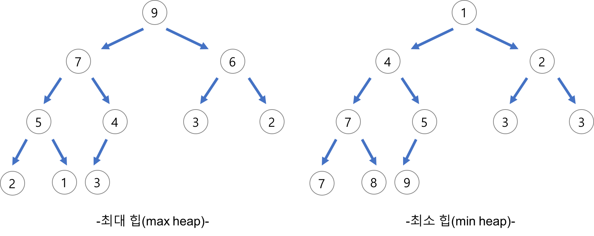
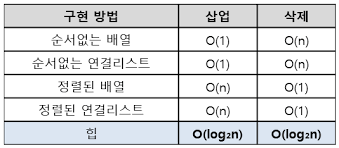

# 트리

## 용어

* Node : 트리 구조의 교점. 데이터를 가지고 있는 지점. 자식 노드 O
* Root Node : 정점 노드
* Edge : 노드와 노드를 잇는 선
* level : 특정 깊이에 있는 노드의 집합
* degree : 각 노드가 지닌 가지의 수
* Leaf Node : 하위 노드, 자식 노드가 없는 노드
* Internal Node : 리프노드가 아닌, 중간에 위치한 노드들

## 특징

* 비선형 자료구조
* 저장하기위한 자료구조 x, 더 효율적인 탐색을 위한 자료구조
* 부모 - 자식 노드간의 계층관계

## 트리의 순회

1. 전위 순회

쉽게 말해서 왼쪽부터 탐색. 루트노드 -> 왼쪽 서브트리 -> 오른쪽 서브트리 순으로 순회하며 왼쪽 서브트리가 있을 때까지 왼쪽으로 순회를 한다.

2. 중위 순회

왼쪽 서브트리 -> 노드 -> 오른쪽 서브트리 순으로 순회

가장 왼쪽 리프노드부터 순회

3. 후위 순회

왼쪽 서브트리 -> 오른쪽 서브트리 -> 노드 순으로 순회 

## 이진 트리(Binary tree)

### 종류

1. 편향 이진 트리 

2. 포화 이진 트리(Full Binary Tree)
   
리프 노드를 제외한 모든 노드의 차수가 두개로 이루어진 경우

3. 완전 이진 트리(Complete Binary Tree)
   
포화 이진트리와 같은 개념으로 모든 노드가 왼쪽부터 차근차근 생성되는 이진트리

4. 이진 탐색 트리(Binary Search Tree)

왼쪽 노드에는 부모노드보다 작은 값이 저장, 오른쪽 노드에는 부모노드보다 큰 값이 저장

모든 노드는 중복된 값을 갖지 않는다.

## 힙(Heap)

> 최대값과 최소값을 빠르게 찾기 위해서 고안된 자료구조
> **완전 이진트리구조**를 가진다.

* 일종의 반정렬 상태(느슨한 정렬)를 유지한다.

    * 여러 개의 값들 중 최대값이나 최솟값을 빠르게 찾아내도록 만들어진 자료구조
    * 부모 노드의 값이 자식 노드보다 항상 큰(작은) 이진 트리이다.
    * 힙 트리에서는 중복된 값을 허용한다.

### 종류

* 최대힙(max heap) : 부모 노드의 값은 자식 노드값보다 크거나 같다.

* 최소힙(min heap) : 부모 노드의 값은 자식 노드값과 작거나 같다.

### 구현

* 힙을 저장하는 표준적인 자료구조는 **배열**이다.
* 힙에서의 부모 노드와 자식 노드의 관계
  
    * 왼쪽 자식의 인덱스 = (부모의 인덱스) * 2
    * 오른쪽 자식의 인덱스 = (부모의 인덱스) * 2 + 1
    * 부모의 인덱스 = (자식의 인덱스) / 2

### 힙의 삽입

1. 새로운 요소를 가장 마지막 노드에 이어서 삽입(배열의 가장 마지막)
2. 새로운 노드와 부모 노드를 비교하여 교환
3. 정점 노드의 값이 최대가 될 때까지 반복

### 힙의 삭제

1. 최대 힙에서 최대값은 루트 노드 -> 루트 노드가 삭제

2. 삭제된 루트 노드에는 힙의 마지막 노드를 가져온다(배열의 가장 마지막 노드)

3. 힙을 재구성(자식 노드와 값을 비교하여 교환 -> 정점 노드가 최대값이 될때까지 반복)

### 우선순위 큐(Priority Queue)

> 일반적인 큐는 FIFO 구조로 돌아가지만, 우선순위 큐는 우선순위가 높은 데이터가 가장 먼저 OUT 되는 구조이다.

* 특성 
  * 모든 항목에는 우선순위가 존재하며 우선순위가 높은 요소는 우선 순위가 낮은 요소보다 먼저 queue에서 제외된다.
  * 두 요소의 우선순위가 같을 경우 FIFO 적용

* 예시
  * 우선순위가 5 -> 9 -> 6 인 데이터가 순서대로 큐에 진입했을 때 9 -> 6 -> 5 순으로 처리가 됨.

* 구현
  * 배열, 링크드 리스트, 정렬된 배열, 정렬된 링크드 리스트로 구현할 수 있으며 각각 enqueue와 dequeue의 시간 복잡도는 다음과 같다.

