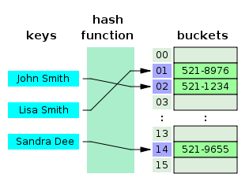

# 해시테이블

## 개념

> 키 - 값(key-value) 쌍을 저장하는 자료구조
> 
> 해시 함수를 사용하여 키를 해시 코드로 변환하고, 이 해시 코드를 인덱스로 사용하여 값을 저장하는 방식을 사용

## 용어

* **키(key)** : 데이터를 찾기 위한 고유한 값
* **값(value)** : 키와 연관된 데이터
* **해시 함수(Hash Function)** : 키를 받아 해시 코드르 반환하는 함수
* **해시 코드(Hash Code)** : 키가 해시 함수를 통과한 후 생성된 코드
* **버킷(Bucket)** : 해ㅑ시 코드를 인덱스로 사용하여 값을 저장하는 공간

## 해시 충돌(Hash Collison)

두 개 이상의 다른 키가 해시 함수를 통과하여 같은 해시 코드를 생성하는 현상

### 해결법 1. 개방 주소법(Open Addressing)

> 충돌이 발생하면 다른 버킷 위치에 데이터를 저장하는 방법
 
* 변형
  1. 선형 조사 : 충돌이 발생하면, 버킷 배열에서 선형적으로 탐색하여 처음으로 비어있는 버킷에 데이터를 저장
  2. 제곱 조사 : 선형 조사와 유사, 제곱 단계로 버킷을 탐색
  3. 이중 해싱 : 두 번째 해시 함수를 사용하여 탐색 간격 결정

### 해결법 2. 분리 연결법(Separate Chaining)

> 각 버킷에 연결 리스트를 사용하여 데이터를 저장. 충돌이 발생할 경우 연결 리스트에 노드를 추가하여 데이터를 저장한다.

* Chaining 방식은 해시 테이블의 확장이 필요 없고 간단하게 구현이 가능하지만, 데이터의 수가 많아지면 동일한 버킷에 chaining되는 데이터가 많아지며 그에 따라 캐시의 효율성이 감소

### 시간 복잡도

* 각각의 Key값은 해시함수에 의해 고유한 index를 가지게 되어 바로 접근 가능 -> 평균 O(1)의 시간복잡도로 데이터를 조회할 수 있다.

* 충돌이 발생한 경우 Chaining에 연결된 리스트들까지 검색을 해야하기 때문에 O(N)까지 증가할 수 있다.

# 그래프

## 개념 

> 노드(Node)와 엣지(Edge)로 구성된 데이터 구조
> 
> 노드는 그래프에서의 개체를 나타내며 엣지는 노드 간의 연결을 나타냄

## 용어

* **노드(Node)** : 그래프에서의 개별적인 요소
* **엣지(Edge)** : 두 노드를 연결하는 선
* 가중치(Weight) : 엣지에 할당된 값(옵션)
* 방향(Direction) : 엣지의 방향(옵션)

## 종류

1. 방향 그래프(Directed Graph) : 엣지에 방향이 있는 그래프
2. 무방향 그래프(Undirected Graph) : 엣지에 방향이 없는 그래프
3. 가중치 그래프(Weighted Graph) : 엣지에 가중치가 할당된 그래프
4. 완전 그래프, 부분 그래프, 연결 그래프, 단절 그래프 등

