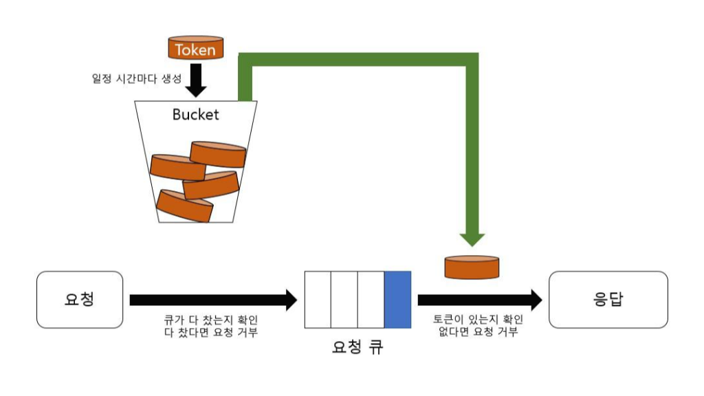
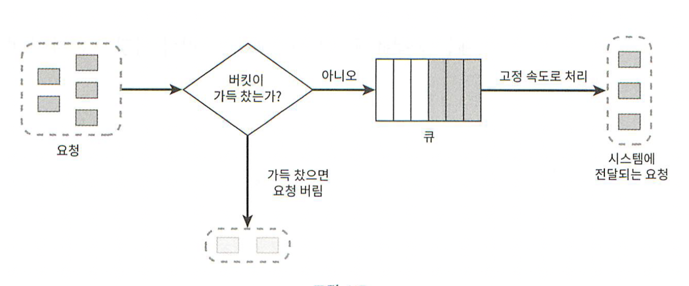
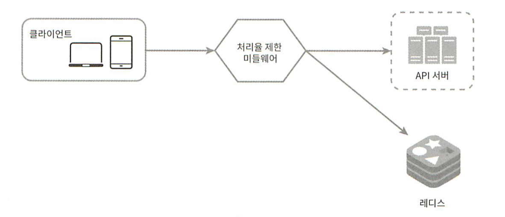

# 처리율 제한 장치 설계

 

### 📜 목차

1. 처리율 제한 장치

2. 처리율 제한 알고리즘

3. 상세 설계

 

## 처리율 제한 장치

 

**처리율 제한 장치** : 클라이언트 또는 서비스가 보내는 트래픽의 처리율을 제어하기 위한 장치, 요청 횟수의 제한이 주를 이룸. API 요청 횟수가 제한 장치에 정의된 임계치를 넘어서면 추가로 도달한 모든 API 요청은 처리가 중단 된다.

* 예 : 같은 디바이스나 같은 IP 주소에게 할당된 API 개수(계정 생성 개수 제한, 리워드 요청 제한), 동일한 사용자에게 할당된 초당 요청 횟수 등

* 처리율 제한 장치의 순기능 : Dos(denial of service)에 의한 자원 고갈 방지 가능

* 비용 절감 : 최대로 오는 요청의 횟수에 대해 알 수 있고, 횟수가 많이 할당된 API에 더 많은 자원 할당 가능, 서드 파티 API(휴대전화 인증 등)에 의존하는 서비스의 경우 이에 횟수 제한을 두면 비용 절감 가능

 

## 처리율 제한 알고리즘

### 1. 토큰 버킷 알고리즘

* 아마존이 사용하는 알고리즘

* 토큰 버킷 : 지정된 용량을 갖는 컨테이너

* 토큰 : 토큰 버킷에 주기적으로 일정된 양이 채워짐. 토큰이 꽉 채워진 버킷에는 더 이상 토큰이 추가되지 않음

#### 동작 
요청이 도착하면 버킷에 충분한 토큰이 있는지 검사 -> 토큰이 있을 경우 버킷에서 토큰 하나를 꺼낸 후 요청을 시스템에 전달, 토큰이 없을 경우 해당 요청 드랍.

* 이 알고리즘은 두 개의 파라미터를 사용하여 실행

    * 버킷 크기

    * 토큰 초당 공급률

* 버킷의 개수 : 통상적으로 API 엔드포인트마다 별도의 버킷을 설치

* 장점 : 구현이 쉽고 메모리 사용 측면에서 효율적

* 단점 : 적절한 두 개의 파라미터 값을 튜닝하는 것이 어려움

 

### 2. 누출 버킷 알고리즘

토큰 버킷 알고리즘과 다르게 요청 처리율이 정해져있음

#### 동작
요청이 도착 -> 큐가 가득 차있는지 확인 -> 빈자리가 있는 경우 큐에 요청 추가, 가득 차 있을 경우 새 요청 드랍 -> 지정된 시간마다 큐에서 요청을 꺼내 처리

* 이 알고리즘은 두 개의 파라미터를 사용하여 실행

    * 버킷 크기 : 요청이 들어갈 큐의 사이즈

    * 처리율 : 지정된 시간당 몇 개의 요청을 처리할지에 대한 값

* 장점 : 큐의 크기를 제한하여 메모리 측면에서 효율적, 고정된 처리율 -> 안정된 출력에 적합

* 단점 : 단시간에 많은 트래픽이 몰릴 경우 새로운 요청들이 대거 버려질 수 있음, 파라미터 튜닝 문제

 

### 3. 고정 윈도 카운터 알고리즘

시간을 고정된 간격(윈도)으로 나누고, 각 윈도마다 카운터를 붙이는 알고리즘.

#### 동작
요청이 접수될 때마다 카운터의 값 +1 -> 카운터의 값이 요청 임계치에 도달하면 해당 윈도 내 새로운 요청은 모두 버려짐, 카운터는 매 시간 기준마다 초기화

* 장점 : 메모리 효율 좋음, 쉬움, 특정한 트래픽 처리에 적합

* 단점 : 윈도 경계 부근(예 : 1분 59초, 2분 1초)에 트래픽이 몰릴 경우 기대했던 성능이 안나올 수 있음

 

### 4. 이동 윈도 로깅 알고리즘

고정 윈도 카운터 알고리즘의 문제점을 해결한 알고리즘
요청의 타임스템프를 추적함, 로그는 레디스와 같은 캐시에 저장됨

#### 동작
* 단위시간당 최대 x회의 요청만을 처리하도록 설정되어있는 처리율 제한기의 경우
    * 요청이 들어왔을 때, 로그에 타임스템프를 추가한다.
    * 만약 단위 시간내 타임스템프가 최대 요청 허용 횟수를 넘을 경우 해당 요청은 거부되며 로그에 타임스템프는 추가된다.
    * 타임스템프가 로그에 기록된 직후에 만료된 타임스템프(단위 시간을 벗어난)가 있을 경우, 로그에서 삭제한다.

* 장점 : 어느 순간의 윈도에서도 시스템의 처리율 한도를 넘지 않음

* 단점 : 거부된 요청의 타임스템프 저장 -> 메모리 효율 하락

 

### 5. 이동 윈도 카운터 알고리즘

참고자료

 

### 개략적 아키텍처

* 어디에 둘 것인가 : 사용자별? IP주소별? API 엔드포인트? 서비스 단위? -> 요구사항, 상황에 맞게

* 카운터 보관 : 캐시가 바람직(DB는 디스크이기 때문에 느려서 안됨), 시간에 기반한 만료 정책 지원, 레디스 짱

* 개략적 구조

#### 동작
클라이언트가 처리율 제한 미들웨어에게 요청 전송 -> 처리율 제한 미들웨어는 레디스의 지정 버킷에서 카운터를 가져와 한도에 도달했는지 검사 -> 도달했을 경우 요청 거부, 도달하지 않았을 경우 요청 서버로 전달 및 카운터 +1 후 레디스에 저장

 

## 상세 설계에서 고려할 점들

### 분산 환경에서의 구현
여 러대의 서버와 병렬 스레드를 지원는 시스템의 경우
* 경쟁 조건(트랜잭션 처리) : 레디스의 sorted set, 루아 스크립트
* 동기화(여러 대의 처리율 제한 장치 동기화 문제) : 고정 세션 등

### 처리율 제한 장치의 성능 최적화
1. 여러 데이터 센터 -> 최대한 유저와 가까운 곳에서 사용자 지원

2. 동기화 -> 최종 일관성 모델 사용 

### 모니터링

1. 채택한 알고리즘이 효과적인가
2. 정의한 처리율 제한 규칙이 효과적인가 

---

### 참고자료

* https://dreamtopia.tistory.com/2

* **가상 면접 사례로 배우는 대규모 시스템 설계 기초**, 알렉스 쉬

* https://velog.io/@shinmj1207/%EC%B2%98%EB%A6%AC%EC%9C%A8-%EC%A0%9C%ED%95%9C-%EC%9E%A5%EC%B9%98%EC%9D%98-%EC%84%A4%EA%B3%84

* 구현 : https://hogwart-scholars.tistory.com/entry/Spring-Boot-%EC%9E%90%EB%B0%94-%EC%8A%A4%ED%94%84%EB%A7%81%EC%97%90%EC%84%9C-%EC%B2%98%EB%A6%AC%EC%9C%A8-%EC%A0%9C%ED%95%9C-%EA%B8%B0%EB%8A%A5%EC%9D%84-%EA%B5%AC%ED%98%84%ED%95%98%EB%8A%94-4%EA%B0%80%EC%A7%80-%EB%B0%A9%EB%B2%95